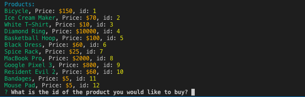

# Bamazon

## Description

This application implements a simple command line based storefront using the npm [inquirer](https://www.npmjs.com/package/inquirer) package and the MySQL database backend together with the npm [mysql](https://www.npmjs.com/package/mysql) package. The application presents two interfaces: **customer** and **manager**.

### MySQL Database Setup

In order to run this application, you should have the MySQL database already set up on your machine. If you don't, visit the [MySQL installation page](https://dev.mysql.com/doc/refman/5.6/en/installing.html) to install the version you need for your operating system. Once you have MySQL isntalled, you will be able to create the *Bamazon* database and the *products* table with the SQL code found in [schema.sql](schema.sql). Run this code inside your MySQL client like [MySQL Workbench](https://dev.mysql.com/downloads/workbench/) to populate the database, then you will be ready to proceed with running the Bamazon customer and manager interfaces.

## Getting Started

- Clone repo.
- Start a database using schema.sql and change the connection parameters.
- Run command in Terminal or Gitbash 'npm install'
- Run node bamazonCustomer.js for the Customer Interface
- Run node bamazonManager.js for the Manager Interface

### Customer Interface

### Manager Interace

